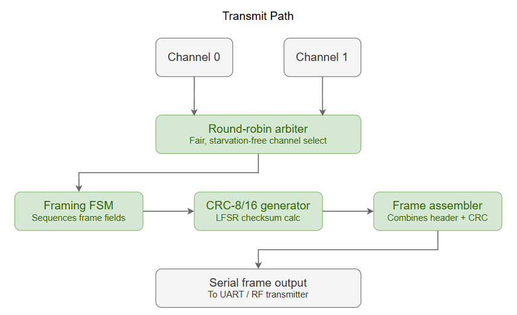
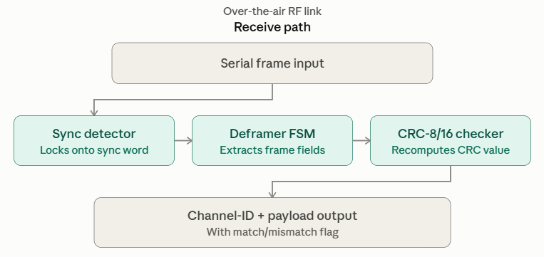

# Unive_OpenSource_Project_Oesmita

# Low-Power CCSDS-Inspired Multi-Channel Telemetry Framer/Deframer with CRC Error Detection

## a. Project Title
Low-Power CCSDS-Inspired Multi-Channel Telemetry Framer/Deframer with CRC Error Detection

## b. Project Objective
The objective of this project is to design, verify, and physically implement (RTL → GDSII) a fully synthesizable digital IP block that arbitrates between multiple telemetry sources, encodes selected data into a structured, CRC-protected frame for transmission, and decodes/validates incoming frames on the receive side — inspired by the framing philosophy used in CCSDS (Consultative Committee for Space Data Systems) telemetry standards employed by real satellite missions. The design is developed in Verilog HDL and implemented using the OpenROAD RTL-to-GDSII flow on the open-source IHP SG13G2 (130 nm) technology, following an industry-standard ASIC design methodology.

*Note: this project uses CCSDS framing as inspiration for structure, not a certified/compliant implementation of the standard.*

## c. Problem Statement
Small satellites and CubeSats typically monitor several subsystems at once — power, thermal, navigation, payload status — each producing telemetry that must be transmitted to the ground reliably. Two problems compound here: first, multiple telemetry sources competing for a single downlink channel need fair, deterministic arbitration so no subsystem's data is starved or overwritten; second, the noisy RF channel can corrupt any transmitted frame, so the ground receiver needs a way to detect corrupted data before acting on it. A dedicated hardware block that both schedules multi-source telemetry into frames and validates received frames addresses both problems with low latency and minimal power draw, well suited to power-constrained satellite platforms built on open-source PDKs.

## d. Application Domain
Aerospace & Satellite Systems

## e. Project Overview
The design consists of two cooperating datapaths:

- **Transmit side:** A round-robin arbiter selects among two telemetry input channels with pending data, tags the frame with a channel-ID field, and passes it to the framing FSM, which assembles a synchronization word, header, payload, and CRC-8/16 checksum (computed via LFSR-based logic) into a serialized output frame.
- **Receive side:** A deframer locks onto the sync word, extracts the header and payload, recomputes the CRC over the received payload, and asserts a match/mismatch flag along with the recovered channel-ID and data.

The design is fully synchronous, uses no memory macros beyond simple registers/FIFOs for per-channel buffering, and is compatible with open PDKs lacking a memory compiler.

## f. Block Diagram

### Transmit Path


Two telemetry channels feed a round-robin arbiter, which selects one channel's data for framing. The framing FSM, CRC-8/16 generator, and frame assembler then package the data into a structured frame for serial output.

### Receive Path


An incoming serial frame is located via sync detection, its fields extracted by the deframer FSM, and its CRC recomputed and checked, producing the recovered channel-ID and payload along with a match/mismatch status flag.

> **Note:** the transmit and receive paths are independent circuits within the same IP block — they are not directly wired to each other, but connected only conceptually through the RF link between transmission and reception.

## g. Features
- 2-channel telemetry input with round-robin arbitration (fair, starvation-free scheduling)
- Configurable frame header, sync word, and channel-ID field
- CRC-8 or CRC-16 error detection via LFSR-based logic, shared generator/checker logic where practical
- Full transmit (encode) and receive (decode/validate) datapaths
- Fully synchronous digital design
- Parameterizable frame length, CRC polynomial, and channel count
- Match/mismatch status flag with recovered channel-ID on the receive side
- Self-checking testbench covering valid frames, corrupted frames, channel arbitration fairness, and edge cases

## h. Design Specifications

| Parameter | Value |
|---|---|
| Technology | IHP SG13G2 (130 nm, open PDK) |
| Language | Verilog HDL (synthesizable) |
| Design Flow | OpenROAD-flow-scripts (ORFS), RTL to GDSII |
| Target Clock Frequency | 50 MHz |
| Data Input Width | 8 or 16 bits per channel |
| Number of Channels | 2 (round-robin arbitrated) |
| CRC Type | CRC-8 or CRC-16 |
| Inputs | ~9-10 (2× telemetry data buses, 2× data-valid, clock, reset, serial frame input) |
| Outputs | ~6-7 (serial frame output, frame-ready, match/mismatch flag, channel-ID out, payload out) |
| Memory Macros | None (flip-flops, combinational logic, small register-based buffers only) |

---

## Repository Structure
```
.
├── rtl/            # Verilog RTL source files
├── sdc/            # Timing constraints
├── config/         # OpenROAD config.mk and flow configuration
├── reports/        # Synthesis, timing, power, area, utilization reports
├── doc/           # Block diagrams, screenshots, technical report
└── README.md
```

## Expected Deliverables
- RTL (.v), SDC (.sdc), and ORFS config.mk in this repository
- Screenshots of each design stage (floorplan, placement, CTS, routing, final layout)
- Reports on area, power, timing (WNS/TNS), utilization, cell count, and clock tree summary
- Final GDSII layout and gate-level netlist
- Technical report covering methodology, implementation flow, arbitration fairness analysis, results, and conclusions

## Glossary of Abbreviations

| Term | Meaning |
|---|---|
| CRC | Cyclic Redundancy Check — an error-detection code computed over transmitted data |
| LFSR | Linear Feedback Shift Register — the shift-register structure with XOR taps used to compute a CRC |
| ID | Identifier — here, the field marking which telemetry channel a frame's data came from |
| IHP SG13G2 | The specific 130 nm semiconductor process/technology offered by IHP (Innovations for High Performance Microelectronics), the open-source foundry PDK used in this project |
| PDK | Process Design Kit — the foundry-provided set of design rules, device models, and libraries needed to design chips for a given fabrication process |
| HDL | Hardware Description Language — a language used to describe digital circuit behavior; Verilog is one such HDL |
| ORFS | OpenROAD-flow-scripts — the open-source toolchain that runs the RTL-to-GDSII physical design flow using OpenROAD |
| RTL | Register Transfer Level — the abstraction level at which digital circuits are described in terms of registers and the logic between them |
| GDSII | Graphic Design System II — the standard file format for a finalized chip layout, submitted to a foundry for fabrication |
| FSM | Finite State Machine — a control circuit that moves between a fixed set of defined states based on inputs |
| WNS / TNS | Worst Negative Slack / Total Negative Slack — timing report metrics indicating how far a design misses (or meets) its target clock period |

---

**Author:** Oesmita Chakma Moon
**Program:** Unive Mentorship Program Summer 2026

